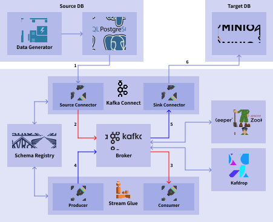
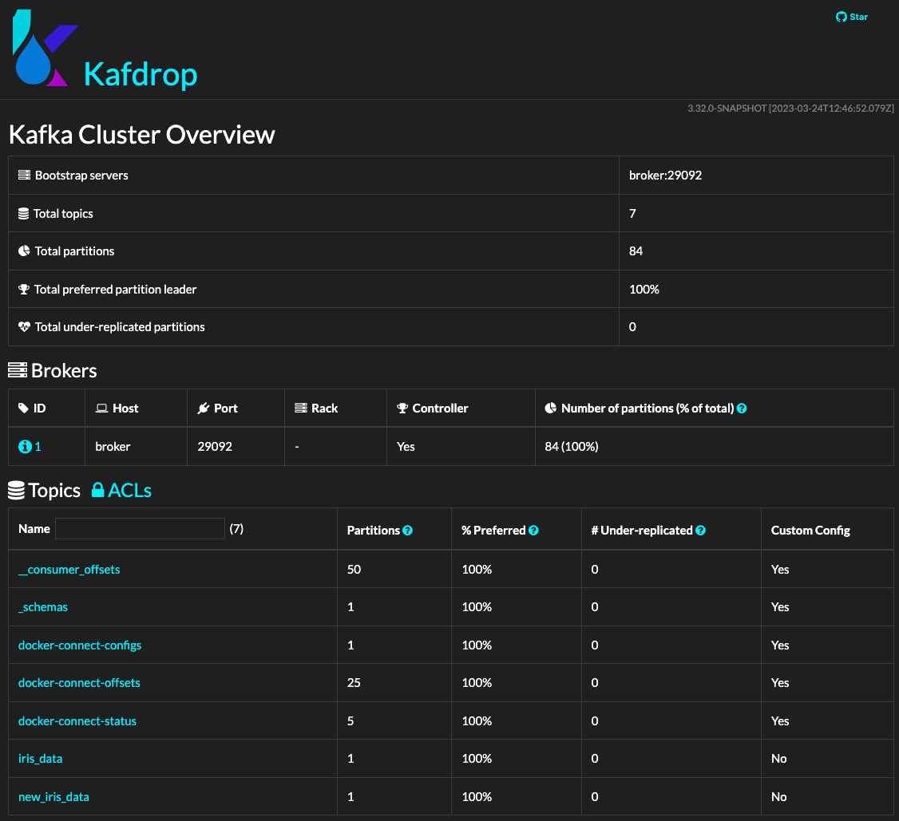
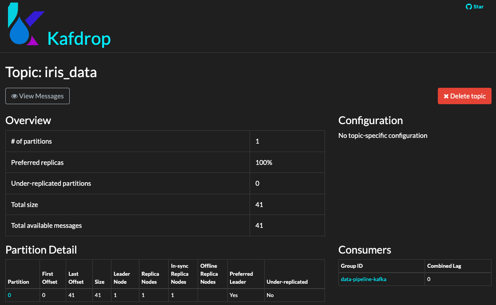
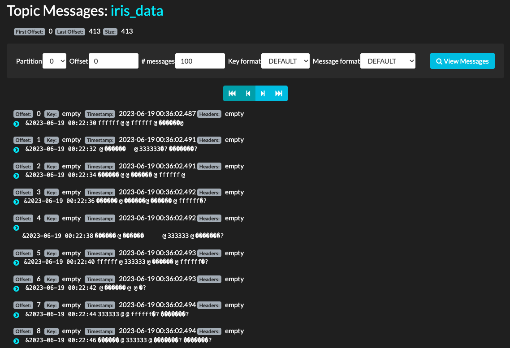
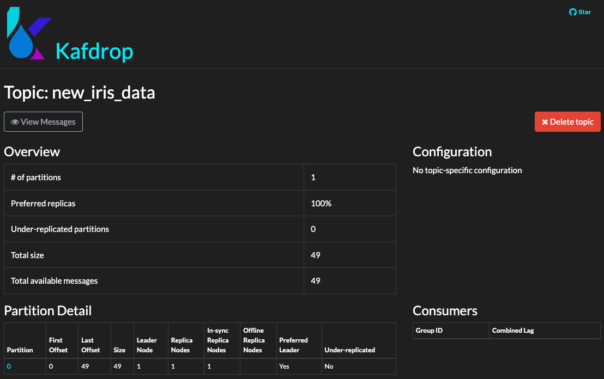
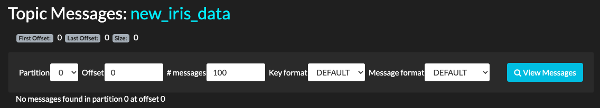
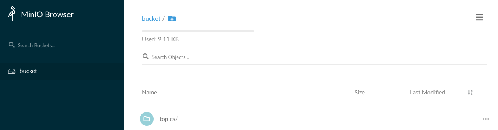
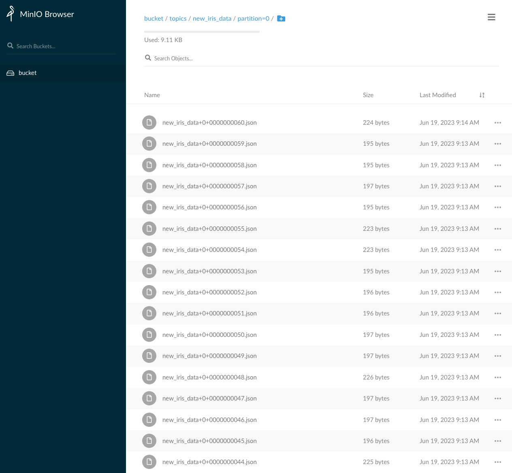

# Data Pipeline Kafka Docker

[](https://opensource.org/licenses/Apache-2.0)
[](https://www.python.org/downloads/release/python-3100)
[](https://github.com/psf/black)
[](https://pycqa.github.io/isort)
[](https://github.com/google/pytype)
[](https://github.com/astral-sh/ruff)

<p align="center"></p>

## Prerequisites

- Install [Docker](https://docs.docker.com/engine/install/).

## Preparation

Install [Python 3.10](https://www.python.org/downloads/release/python-3100/) on [Pyenv](https://github.com/pyenv/pyenv#installation) or [Anaconda](https://docs.anaconda.com/anaconda/install/index.html) and execute the following commands:

```bash
$ make init             # setup packages (need only once)
```

## How To Play

### 1. Create Infra

```bash
$ make compose          # create all the containers
```

You can delete the containers.

```bash
$ make compose-clean    # delete the containers
```

You can divide the containers and create them.

```bash
$ make db               # create a postgres (source DB), a minio (target DB), a data generator, and a bucket creator (need only once)
$ make kafka            # create a kafka cluster (need only once)
$ make glue             # create a glue process that ETLs data (need only once)
```

You can delete the divided containers.

```bash
$ make glue-clean       # delete the glue process
$ make kafka-clean      # delete the kafka cluster
$ make db-clean         # delete the databases and the rest.
```

### 2. Check Source DB

You can access the source DB (PostgreSQL DB) and check that the data is being added.

You can check the data in source DB by installing `psql`.

```bash
# MacOS
$ brew install libpq

# Ubuntu & Debian
$ apt-get install postgresql-client
```

You can use the `psql` command to access the source DB below.

```bash
$ PGPASSWORD=postgres psql -h localhost -p 5432 -U postgres -d postgres
psql (15.3, server 14.0 (Debian 14.0-1.pgdg110+1))
Type "help" for help.

postgres=# \d
                List of relations
 Schema |       Name       |   Type   |  Owner
--------+------------------+----------+----------
 public | iris_data        | table    | postgres
 public | iris_data_id_seq | sequence | postgres
(2 rows)

postgres=# select * from iris_data limit 5;
 id |      timestamp      | sepal_length | sepal_width | petal_length | petal_width | target
----+---------------------+--------------+-------------+--------------+-------------+--------
  1 | 2023-06-19 00:22:30 |          7.6 |           3 |          6.6 |         2.1 |      2
  2 | 2023-06-19 00:22:32 |            5 |         3.2 |          1.2 |         0.2 |      0
  3 | 2023-06-19 00:22:34 |          6.7 |           3 |          5.2 |         2.3 |      2
  4 | 2023-06-19 00:22:36 |          6.7 |         3.1 |          4.4 |         1.4 |      1
  5 | 2023-06-19 00:22:38 |          5.9 |         3.2 |          4.8 |         1.8 |      1
(5 rows)
```

### 3. Check Kafka Topics

You can access `localhost:9009` on a web browser and see the topics in Kafka through Kafdrop.

<p align="center"></p>

You can click the `iris_data` topic on the main screen of Kafdrop and click `View Messages` to see the data being produced to the `iris_data` topic through the JDBC source connector.

<p align="center"></p>

<p align="center"></p>

Similarly, you can click the `new_iris_data` topic on the main screen and click `View Messages` to see the data being produced to the `new_iris_data` topic through the Glue process.

<p align="center"></p>

<p align="center"></p>

### 4. Check Target DB

You can access `localhost:9900` on the web browser and see the data being consumed in MinIO.

<p align="center"></p>

<p align="center"></p>

Yon can download and see the data, and you can check that it is in a different type from the data in the source DB.

```json
{
  "id":12,
  "timestamp":"2023-06-19 10:32:56",
  "sepal_length":6.1,
  "sepal_width":3.0,
  "sepal_sum":9.1,
  "sepal_mean":4.55,
  "petal_length":4.9,
  "petal_width":1.8,
  "petal_sum":6.7,
  "petal_mean":3.35,
  "target":2
}
```

As shown in the landscape, you can confirm that the Glue process consumes the data in the `iris_data` topic, updates the type and value of the data, and then produces it to the `new_iris_data` topic.

Let's make the data pipeline using Kafka together with this repository!

## For Developers

```bash
$ make check          # run all static analyses
$ make format         # format scripts
$ make lint           # lint scripts
```
